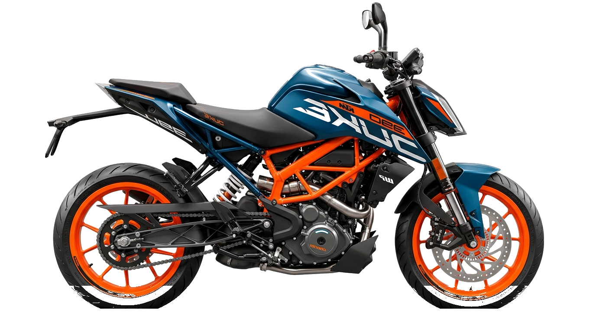

# 2024 KTM 390 DUKE // THE CORNER ROCKET

> Interactive 3D CAD Disassembly, Real-time Physics Gravity Drop Runway, Audio Synthesizer Engine & Telemetry Experience.



---

## ⚡ Highlights & Features

- **100-Frame 3D Exploded Hero View**: Custom sub-pixel lerp canvas player with interactive scrub and full CAD explosion sequence.
- **Physics Gravity Drop Runway & Component Disassembly**: GSAP ScrollTrigger engineering breakdown showcasing LC4c engine, trellis frame, WP APEX suspension, and braking system.
- **Procedural Engine Audio Synthesizer**: Web Audio API single-cylinder 4-stroke procedural sound engine simulating real-time throttle revving and power delivery.
- **5" TFT Cockpit Simulator**: Interactive ride modes (Street, Rain, Track), Launch Control, Supermoto ABS toggle, and live speedometer.
- **Colorway Configurator**: Dynamic dual-tone selector between Signature Electronic Orange and Atlantic Blue.
- **Bottom Velocity Runner**: Dynamic progress runner with real-time waypoint velocity calculation tracking scroll depth across all 6 sections.
- **Production Ready**: Zero external framework dependencies — pure modern HTML5, CSS3, and ES6+ JavaScript.

---

## 🚀 Live Deployment on Vercel

1. Push to GitHub: `https://github.com/9shankar805/duke390.git`
2. Import the repository into **[Vercel](https://vercel.com/)**.
3. Framework Preset: **Other** / **Static Site**.
4. Root Directory: `./`
5. Click **Deploy**.

---

## 🛠 Local Development

To run locally:
```bash
# Using Python built-in server
python3 -m http.server 5173

# Or using Node npx serve
npx serve .
```
Then visit `http://localhost:5173` in your browser.

---

© 2024 KTM Sportmotorcycle GmbH // READY TO RACE
